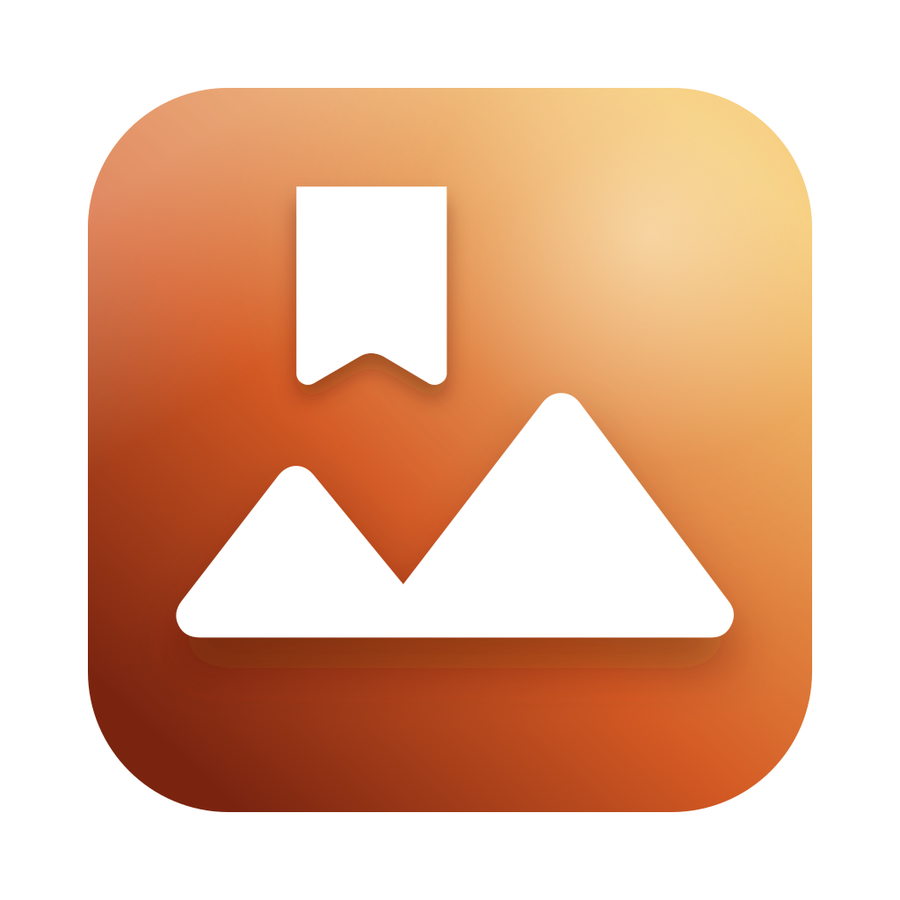

# Gacho

Comic Book ZIP viewer

Rust の勉強がてら、自分用に CBZビューア ってことで、Gacho（画帳）を作ってみようと思って作成なぅ。

フォルダやアーカイブ、画像をドロップすると、その本を開きます。同じフォルダのアーカイブはパス順につながっていて、最後のページの次で次の本へ、最初のページの前で前の本へ移ります。

## Supported formats

開けるのは次の拡張子です。アーカイブの中も、ばらの画像も同じ形式です。

| Extension                | How it opens         |
| ------------------------ | -------------------- |
| `.zip` / `.cbz`          | 1冊として開く。中の画像がページになる  |
| `.jpg` / `.jpeg`         | 同じフォルダの画像を、パス順に1冊にする |
| `.png` / `.bmp` / `.gif` | 同上                   |
| `.webp` / `.avif`        | 同上                   |

ファイルを選ぶダイアログはアーカイブだけです。画像のフォルダはドロップするか、フォルダを開いてください。

アーカイブ内の隠しファイルと `__MACOSX` は読み飛ばします。ファイル名は Shift_JIS として解釈します。

## Usage

- フォルダ、アーカイブ、画像を **ドラッグ＆ドロップ**（複数なら先頭だけ）
- 右上のファイルボタンからアーカイブを開く
- 右上のフォルダボタンから開く（macOS はアーカイブとフォルダを同時選択可。それ以外はフォルダのみ）
- OS の「このアプリで開く」や、起動時に渡したパスでも開く

画像を開くと、そのフォルダの画像が1冊になり、開いたファイルのページから表示します。フォルダを開いたときは、中にアーカイブがあればパス順の先頭を開き、なければフォルダ内の画像を1冊にします。

上部のタイトルは、ファイル名（画像フォルダならフォルダ名）から取ります。`(カテゴリ)[著者]タイトル(ジャンル)` や `[著者]タイトル` なら、タイトルの部分だけを使います。

右上のクリアボタン、または ⌘W / Ctrl+W で、開いている本を閉じます。

## Pages

見開きと表紙の扱いは設定の Page Layout / Cover Layout です。変更は本を開き直すまで反映されません。

| Layout          | Behavior                    |
| --------------- | --------------------------- |
| Single Page     | 1ページずつ（既定）                  |
| Two-Page Spread | 縦長を見開きにする。横長は1ページのまま        |
| Single Cover    | 先頭を表紙として単独表示し、続きを見開きにする（既定） |
| No Single Cover | 先頭から見開きにする                  |

並びは Read From に従います。Right to Left（既定）では、見開きの右が若いページです。

下部は `#ページ / 総ページ` とファイル名です。見開きは `1-2` のようにまとめて出します。スライダーは見開き単位で移動し、Right to Left では右端が先頭です。

## Mouse & keyboard

ページ送りです。Right to Left では左が次、右が前です。Left to Right では逆になります。本の端では、同じフォルダの前後のアーカイブへ移ります。

| Input                   | Behavior             |
| ----------------------- | -------------------- |
| Click on left half / ←  | 次のページ（Right to Left） |
| Click on right half / → | 前のページ（Right to Left） |
| 下部の左向き矢印                | ← と同じ                |
| 下部の右向き矢印                | → と同じ                |

アプリ全体のショートカットです。macOS は ⌘、その他は Ctrl です。

| Input              | Behavior                   |
| ------------------ | -------------------------- |
| ⌘O / Ctrl+O        | アーカイブを開く                   |
| ⌘⇧O / Ctrl+Shift+O | フォルダを開く                    |
| ⌘, / Ctrl+,        | 設定を開く                      |
| ⌘W / Ctrl+W        | 開いている本を閉じる。設定ウィンドウでは設定を閉じる |

## Settings

歯車アイコン、または ⌘, / Ctrl+, から設定ウィンドウを開きます。閉じるのは、そのウィンドウでの ⌘W / Ctrl+W です。値は次回起動時に復元されます。

### General

| Setting      | Behavior                                                                         |
| ------------ | -------------------------------------------------------------------------------- |
| Page Layout  | Single Page / Two-Page Spread（既定 Single Page）                                    |
| Cover Layout | Single Cover / No Single Cover（既定 Single Cover）。Page Layout とあわせて、本を開き直すまで反映されない |
| Read From    | Right to Left / Left to Right（既定 Right to Left）                                  |
| Preloading   | 0–10。前後の見開きを先に読む数（既定 5）                                                          |

### About

バージョン・ライセンス・リポジトリと、GitHub Releases へのアップデート確認があります。

## License

[Apache-2.0](https://github.com/yoshitaka-k/gacho/blob/main/LICENSE)
